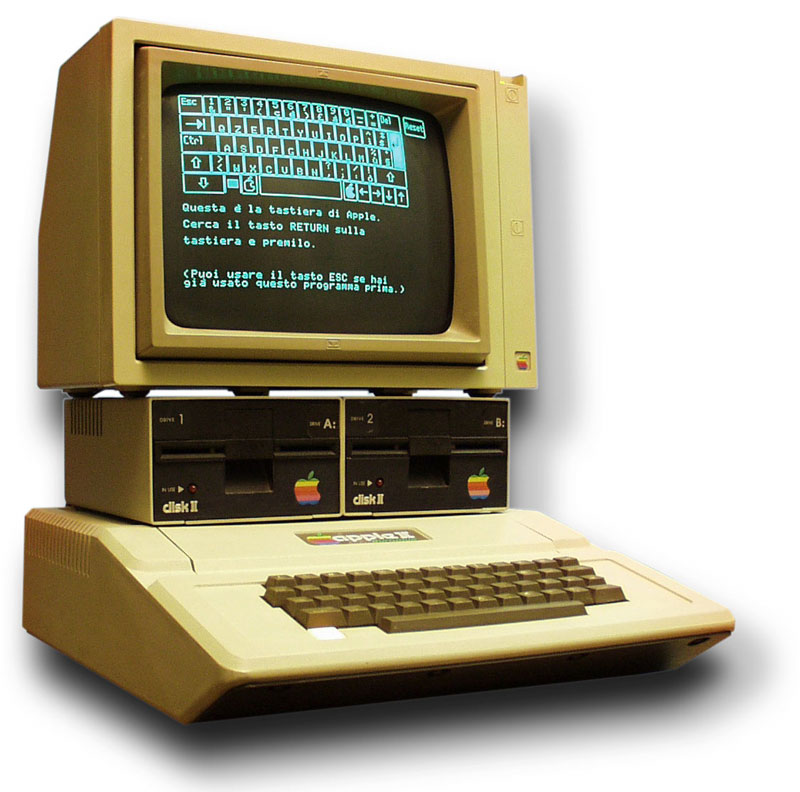

<div align="center">

# 🍏 POM2 v0.7 — Apple II Emulator

### *Six machines from 1977 to 1988, beam-raced to the scanline — then tilted into 3D and rewound through time.*

🎂 **Celebrating 50 years of Apple (1976 → 2026)** with a cycle-accurate Apple II family emulator: **6 one-click machine presets** (][ · ][+ · //e · //e enhanced · //c · //c+), MAME-faithful CPU and hardware ports, OpenEmulator-grade composite NTSC, a MicroM8-style **3D voxel view**, **time-travel rewind**, mechanical floppy sounds, and a stack of expansion cards from Mockingboard to Phasor — all running in the browser too.

Built with Dear ImGui & OpenGL — fast, lightweight, cross-platform.

[](https://habib256.github.io/POM2/wasm/)

[](LICENSE)
[](#-quick-start)
[](#)
[](#-machine-profiles)
[](DEV.md)



</div>

---

## 🌟 Why POM2?

> *Most Apple II emulators give you a screen and a disk drive. POM2 gives you the bus, the beam, the phosphor — and a time machine.*

- 🎞️ **Beam-raced to the scanline.** Soft-switch flips mid-frame land on the exact scanline the CPU touched them — split-screen demos, hi-res/text mode swaps and AN3 DHGR toggles render correctly. The composite NTSC path beam-races too, so artifact colour follows the same event log the RGBA path does.
- 🧊 **Tilt the screen into 3D.** A MicroM8-style **voxel view** lifts the Apple II framebuffer off the glass into an orbiting 3D scene — pixels become extruded voxels you can fly around with a real camera.
- ⏪ **Rewind time.** A snapshot ring buffer records the machine as it runs; scrub backwards through your last seconds of execution and resume from any point. Same serializer feeds the AI-control HTTP `/snapshot` endpoints, so they can never drift.
- 📺 **CRT you can dial in.** OpenEmulator-style composite NTSC shader *and* AppleWin's CPU IIR-LUT NTSC, plus mono phosphor with an adjustable **phosphor curve** (luminance γ) and **persistence** (temporal glow), barrel distortion, hue/BCS — the full *View → CRT Settings* panel.
- 💾 **Disks that sound right.** Cycle-stamped mechanical floppy samples: the Disk II head step and the Sony 3.5" drive whir, timed off the CPU clock — disk-turbo collapses wall-clock gaps but the nibble stream stays cycle-correct via an event-driven LSS.
- 🎵 **A whole sound-card era.** Speaker, cassette, Mockingboard A/C, Mockingboard C **Sound II** with SSI263 speech, the Applied Engineering **Phasor** (2×VIA / 4×AY), and the Cricket / Echo SSI263 line.
- 🔬 **MAME is the source of truth.** Every hardware port cites the MAME file + line range in a comment and is pinned with a smoke test under `tests/`. CPU → audio/UI events carry a CPU-cycle stamp, never wall-clock.
- 🌐 **Runs in your browser.** The full emulator builds to WebAssembly — [play it now](https://habib256.github.io/POM2/wasm/), no install.

---

## ⚡ 60-second tour

Five things to try **right after first boot**:

1. **Boot a disk in one drag** → drop a `.woz`/`.dsk` on the window, or `POM2 path/to/game.woz`. POM2 routes it to Disk II, SmartPort or ProDOS HDV automatically.
2. **Switch machines live** → `Machine → Profile` (or `--preset iie`). Each switch is a clean cold reset that re-plugs built-in cards and re-mounts your disks.
3. **Tilt into 3D** → open the **3D voxel view** and orbit the running framebuffer with the camera. Lo-res, hi-res and text all extrude into voxels.
4. **Rewind** → let something run, then scrub the rewind ring backwards and resume from an earlier instant (`--rewind` on the CLI).
5. **Tune the CRT** → `View → CRT Settings`: swap composite NTSC ↔ mono phosphor, push the phosphor curve and persistence, add scanline glow and barrel.

---

## 🚀 Quick Start

### 🐧 Linux / 🍏 macOS

```bash
git clone https://github.com/habib256/POM2.git
cd POM2
./setup_imgui.sh                    # fetch Dear ImGui + install deps (one-time)
cd build && cmake .. && make -j
cd .. && ./run_emulator.sh          # cwd = repo root so roms/ probes resolve
```

`setup_imgui.sh` covers macOS, Debian/Ubuntu, Fedora and Arch.

### 🪟 Windows

Prereqs: [Visual Studio](https://visualstudio.microsoft.com/) (C++ workload), [CMake](https://cmake.org/download/), [Git](https://git-scm.com/download/win), [vcpkg](https://vcpkg.io/).

```batch
git clone https://github.com/habib256/POM2.git
cd POM2
vcpkg install glfw3:x64-windows
cd build && cmake .. && cmake --build . --config Release
```

### 🌐 WebAssembly

**Play directly:** [POM2 in your browser](https://habib256.github.io/POM2/wasm/)

<details><summary>Build it yourself</summary>

```bash
./build_wasm.sh                     # build
./build_wasm.sh --serve             # build + local server
./build_wasm.sh --with-data         # bundle roms/ fonts/ pic/ floppyemu/
```

The browser build preloads `roms/`, `fonts/`, `pic/` and `floppyemu/`, but **user Apple ROMs are still required**. Telnet and the AI-control HTTP server are compiled out under WASM.
</details>

### 💿 Drop in ROMs and media

Apple ROMs are **user-provided** — POM2 bundles none. Drop your files here:

```text
roms/         Apple II firmware dumps
disks_5.4/    5.25" disk images
disks_3.5/    3.5" disk images
hdv/          ProDOS hard-disk images
floppyemu/    Floppy Emu / BMOW media
```

```bash
POM2 path/to/game.woz               # mount + cold-boot
POM2 --kiosk path/to/game.dsk       # exclusive full-screen, chrome-free
```

---

## ⌨️ Keyboard Shortcuts

| Host | Apple II | Host | Apple II |
|------|----------|------|----------|
| Enter | Return | Left Alt | Open-Apple (`$C061`) |
| Backspace | Left arrow | Right Alt | Solid-Apple (`$C062`) |
| Arrows | Apple II arrows | `Ctrl-A..Z` | `$01..$1A` |
| Esc | ESC | F9 | Screenshot → `screenshot_NNN.ppm` |
| F11 | Soft reset / Ctrl-Reset | F12 | Hard reset / power-cycle |

F9 / F11 / F12 and both Alt keys are routed unconditionally — even when ImGui holds keyboard focus. GLFW gamepads are hot-plugged and auto-bound.

---

## 🖥️ Machine Profiles

Six one-click machines spanning the line. Switch from `Machine → Profile` or `--preset`. Each switch is a full cold reset that re-plugs built-in cards and re-mounts inserted disks where possible.

| Profile | CPU | Mode | Main ROM probes | Built-in slots (locked) |
|---|---|---|---|---|
| **Apple ][ Original** (1977) | NMOS 6502 | — | `apple2o.rom`, `apple2.rom` | — |
| **Apple ][+** (1979) | NMOS 6502 | — | `apple2p.rom`, `apple2.rom` | — |
| **Apple //e Unenhanced** (1983) | NMOS 6502 | IIe | `apple2e_unenh.rom`, `apple2e.rom` | AUX = ext80 |
| **Apple //e Enhanced** (1985) | 65C02 | IIe | `apple2e.rom` | AUX = ext80 |
| **Apple //c** (1984) | 65C02 | IIe | `apple2c-32Kv0.rom`, `apple2c-16K.rom` | sl1/2 SSC · sl4 Mouse · sl5 SmartPort · sl6 Disk II |
| **Apple //c+** (1988) | 65C02 | IIe | `apple2cp.rom`, `apple2c-plus.rom` | sl1/2 SSC · sl4 Mouse · sl5 SmartPort 3.5" · sl6 Disk II |

Aliases for `--preset`: `apple2`/`ii`, `apple2plus`/`ii+`, `iie-u`, `apple2e`/`iie`, `apple2c`/`//c`, `apple2cplus`/`//c+`.

> **ROM identity check** — when the generic `apple2.rom` fallback resolves (no profile-specific dump present), the loader warns that the ROM may not match the selected machine.

---

## ✨ Hardware

**Core** — MAME-faithful **6502 / 65C02 / Rockwell / WDC** CPU; full IIe paging, Language Card + aux LC, and **RamWorks III up to 8 MB**; running at `POM2_CPU_CLOCK_HZ = 1 022 727` (14.31818 MHz / 14), 17045 cycles/frame (//c+ defaults to 4× for its Zip-style accelerator).

| Subsystem | Highlights |
|---|---|
| 📺 **Video** | Text · lo-res · hi-res · double hi-res · 80-column. **Beam-raced** mid-scanline soft switches. Composite NTSC (OpenEmulator-style shader) · AppleWin NTSC (CPU IIR-LUT) · mono phosphor with adjustable curve + persistence · Video-7 RGB · Le Chat Mauve RGB. |
| 🧊 **3D voxel view** | MicroM8-style — framebuffer extruded into orbiting voxels with a real camera (`Voxel3DRenderer` + `Mat4`). |
| ⏪ **Rewind** | MicroM8-style snapshot ring buffer; scrub back and resume. Shares its serializer with the AI-control `/snapshot` endpoints. |
| 🔊 **Audio** | Speaker · cassette · Mockingboard A/C · Mockingboard C **Sound II** (SSI263 speech) · Applied Engineering **Phasor** (2×VIA / 4×AY) · Cricket / Echo SSI263 · Echo+ TMS5220 scaffold · cycle-stamped Disk II + Sony 3.5" mechanical sounds. |
| 💾 **Storage** | `.dsk` `.do` `.po` `.nib` `.2mg` `.2img` `.woz` `.hdv` · DOS 3.x · ProDOS · SmartPort · CFFA 2.0. WOZ uses the real Disk II P6 LSS sequencer; detection is content-driven (MacBinary, DOS/ProDOS skew, WOZ/2IMG write-protect handled). |
| 🔌 **Peripherals** | Super Serial (+ telnet bridge) · parallel printer with host spool · Orange Micro Grappler+ · ProDOS Clock / ThunderClock+ · Mouse Card (MAME + AppleWin HLE) · joystick / paddles · Floppy Emu (BMOW) · on-board //c devices. |
| 🛠️ **Tools** | Disk Library · Slot Configuration · screenshots · memory viewer · snapshots · kiosk mode · CLI · AI-control HTTP server. |

---

## 🃏 Expansion Cards

Assign cards, mount media, eject or boot from `Machine → Slot Configuration`. A typical II / II+ / //e setup: **sl2** Super Serial · **sl4** Mockingboard/Phasor · **sl5** HDV or SmartPort · **sl6** Disk II · **sl7** Le Chat Mauve RGB. On //c and //c+ the built-in slots are locked.

| Key | Card | Key | Card |
|---|---|---|---|
| `diskii` | Disk II | `clock` | ProDOS Clock / ThunderClock+ |
| `hdv` | ProDOS HDV | `chatmauve` | Le Chat Mauve RGB |
| `cffa` | CFFA 2.0 IDE | `mouse` / `mouseaw` | Mouse Card (MAME / AppleWin HLE) |
| `smartport35` | SmartPort 3.5" | `mockingboard` | Mockingboard A/C |
| `ssc` | Super Serial Card | `mockingboard_c` | Mockingboard C Sound II + SSI263 |
| `printer` | Parallel printer (host spool) | `phasor` | Applied Engineering Phasor |
| `grappler` | Orange Micro Grappler+ | `echoplus` | Cricket / Echo SSI263 |
| | | `echoplus_tms` | Echo+ TMS5220 + 2×AY scaffold |

---

## 📺 Video — beam, NTSC, phosphor & 3D

POM2's renderer is **event-driven, not frame-snapshot**. Soft-switch writes carry a CPU-cycle stamp; the display reconstructs the frame from that event log, so mid-scanline mode changes (TEXT-over-HGR splits, page flips, AN3 DHGR pulses through the Le Chat Mauve FIFO) land on the right scanline. The composite signal beam-races on the same log — pinned by `beam_race_composite`.

- **Composite NTSC** — OpenEmulator-style fragment shader (`NtscPostProcessor` / `OpenGLShader`): barrel → hue → BCS → phosphor curve → glow.
- **AppleWin NTSC** — the alternative CPU-side IIR-LUT colour path (`AppleWinNtsc`).
- **Mono phosphor** — adjustable **phosphor curve** (`ntsc_phosphor_gamma`, luminance half of the CRT model) and **persistence** (temporal half), tunable in *View → CRT Settings*.
- **RGB cards** — Video-7 and Le Chat Mauve for IIe-class machines.
- **3D voxel view** — lift the whole framebuffer into an orbiting voxel scene.

---

## 🔊 Audio — speaker to Phasor

Every audio event is cycle-stamped, so tempo follows emulation speed, not wall-clock — disk-turbo's ~60× collapse of wall-clock gaps stays inaudible. The bus carries the **Speaker** and **Cassette**, plus a full card stack: **Mockingboard A/C** (6522 VIA + AY-3-8910), **Mockingboard C Sound II** with the **SSI263** speech chip, the **Phasor** (2 VIAs driving 4 AYs), and the **Cricket / Echo** SSI263 line. Mechanical **floppy sounds** (`FloppySoundDevice`) consume the cycle stamp emitted by `DiskIICard::seekPhaseW`, so head-steps and drive whir line up with the LSS nibble stream.

---

## 💾 Storage — disks, SmartPort, CFFA

Supported images: `.dsk` `.do` `.po` `.nib` `.2mg` `.2img` `.woz` `.hdv`. Detection is **content-driven** — MacBinary wrappers, DOS/ProDOS sector skew and WOZ/2IMG write-protect flags are all handled. WOZ playback runs the genuine Disk II **P6 LSS sequencer** (`diskii_p6.rom` required). ProDOS block devices back the HDV / CFFA 2.0 / SmartPort paths.

Accepted main ROM sizes: 12 KB, 16 KB, 20 KB system packs (with 4 KB filler), and 32 KB system+video ROMs.

| File | Role |
|---|---|
| `apple2e.rom` | //e firmware (+ optional charset) |
| `apple2cp.rom` | //c+ banks 0 + 1 |
| `apple2_char.rom` | Character ROM |
| `disk2.rom` / `disk2_13.rom` | Disk II boot PROMs |
| `diskii_p6.rom` | Disk II P6 LSS sequencer (required for WOZ) |
| `cffa20ee02.bin` / `cffa20eec02.bin` | CFFA 2.0 firmware |
| `mouse_341-0270-c.bin` / `mouse_341-0269.bin` | Mouse Card slot ROM / 68705 MCU mask ROM |
| `roms/floppy_samples/*.wav` | Mechanical drive samples |

---

## 🎛️ Command line

```bash
POM2 <disk-image>                   # mount into the right slot + cold-boot
POM2 --kiosk <disk-image>           # exclusive full-screen, chrome-free, read-only
POM2 --preset ii|ii+|iie-u|iie|iic|iic+
POM2 --snapshot-save out.pom2snap
POM2 --snapshot-load in.pom2snap
```

More flags: `--speed`, `--cpu-max`, `--tape`, `--35-disk1`, `--35-disk2` (//c+ Sony 3.5"), `--load addr:file`, `--run`, `--step`, `--paste`, `--play`, `--rec`, `--rewind`. Full architecture → [`CLAUDE.md`](CLAUDE.md).

---

## 📦 Releases

```bash
./build_dist.sh                     # relocatable tarball + .deb (+ AppImage if linuxdeploy present)
./build_dist.sh --tests             # build + run the pinned smoke tests
```

Apple ROMs are **never** bundled in any artifact.

---

## ⚠️ Known Limitations

- Mouse absolute position can drift under A2Desktop / MGTK.
- Some anti-//e copy-protected titles refuse to boot on //e/c/c+ hardware.
- //c+ Sony 3.5" boot uses the built-in slot-5 SmartPort path; the full IWM bit-shift state machine is not yet modeled.

---

## 🛠️ Developer Notes

- [`CLAUDE.md`](CLAUDE.md) — always-loaded orientation index (build, memory map, profiles, reset architecture, CLI).
- [`DEV.md`](DEV.md) — implementation deep-dives, MAME-parity ports, internals, gotchas, pinned tests.
- [`TODO.md`](TODO.md) — active backlog + MAME ↔ POM2 parity dashboard.
- [`CHANGELOG.md`](CHANGELOG.md) — resolved items and the **why** behind non-obvious fixes.

**Conventions**: one concern per `.cpp/.h` pair · MAME = source of truth (cite the file + line range, pin a smoke test under `tests/`) · `emuCycles` everywhere — CPU → audio/UI events carry a cycle stamp, never wall-clock.

---

## 👏 Credits

- **Arnaud Verhille** — POM2 emulator & Dear ImGui port.
- **The MAME team** — the hardware reference POM2 ports cite line-by-line.
- **AppleWin**, **OpenEmulator** and **MicroM8** — NTSC colour models, LSS sequencing, and the 3D-voxel / rewind inspiration.
- **Steve Wozniak & Steve Jobs** — for creating the Apple II 🍎

## 🔗 Resources

- [POM2 in your browser](https://habib256.github.io/POM2/wasm/) — WebAssembly build.
- Architecture → [CLAUDE.md](CLAUDE.md) · Internals → [DEV.md](DEV.md) · Backlog → [TODO.md](TODO.md).

---

## 📄 License

GPL-3.0 — see [LICENSE](LICENSE).

<div align="center">

*Made with ❤️ for the Apple II community*

</div>
