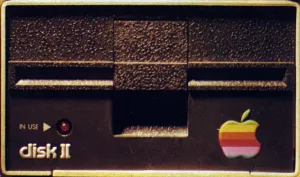

# POM2 — Apple II Emulator



Apple II / II+ / //e / //c / //c+ emulator built on Dear ImGui.
MOS 6502 / 65C02, 48 KB – 8 MB RAM, text / lo-res / hi-res / DHGR
video, speaker / cassette / Mockingboard / floppy mechanical sound,
joystick, mouse, and an 8-slot peripheral bus.

## Quick start

```bash
./setup_imgui.sh   # one-time: deps + clone Dear ImGui
cd build && cmake .. && make -j
./run_emulator.sh
```

`setup_imgui.sh` covers macOS (Homebrew), Debian/Ubuntu (apt), Fedora
(dnf), Arch (pacman). Windows: install GLFW via vcpkg and run CMake
by hand. Drop ROMs into `roms/`, 5.25" images into `disks/`, 3.5" into
`disks35/`, hard-disk images into `hdv/`, and Floppy Emu (BMOW) images
into `floppyemu/`.

## System profiles

| Profile | CPU | iieMode | Main ROM probes |
|---|---|---|---|
| Apple ][ (1977)          | NMOS  | off | `apple2o.rom`, `apple2.rom` |
| Apple ][+ (1979)         | NMOS  | off | `apple2p.rom`, `apple2.rom` |
| Apple //e Unenh. (1983)  | NMOS  | on  | `apple2e_unenh.rom`, `apple2e.rom` |
| Apple //e Enh. (1985)    | 65C02 | on  | `apple2e.rom` |
| Apple //c (1984)         | 65C02 | on  | `apple2c-32Kv0.rom`, `apple2c-16K.rom` |
| Apple //c+ (1988)        | 65C02 | on  | `apple2cp.rom`, `apple2c-plus.rom` |

`Machine → Profile` or `--preset <ii|ii+|iie-u|iie|iic|iic+>`. Switching
profiles cold-resets and re-plugs cards; previously inserted disks
re-mount across the switch.

## ROM placement

Drop ROMs into `roms/`. Sizes accepted: 12 KB (II/II+), 16 KB (II+/IIe/
IIc), 20 KB system-pack (4 KB filler skipped), 32 KB system+video
(IIe/IIc/IIc+).

| File | Size | Role |
|---|---|---|
| `apple2e.rom`          | 16 / 32 KB | //e firmware (+ optional charset) |
| `apple2cp.rom`         | 32 KB | //c+ banks 0 + 1 (ROMSWITCH `$C028`) |
| `apple2_char.rom`      | 2 / 4 KB | Character ROM (4 KB = IIe + mousetext) |
| `disk2.rom`            | 256 B | Disk II P5A 16-sector boot PROM |
| `disk2_13.rom`         | 256 B | Disk II 341-0009 13-sector boot PROM (DOS 3.2) |
| `diskii_p6.rom`        | 256 B | Disk II P6 LSS sequencer (required for `.woz`) |
| `cffa20ee02.bin` / `cffa20eec02.bin` | 4 KB | CFFA 2.0 firmware (6502 / 65C02) |
| `mouse_341-0270-c.bin` | 2 KB  | Mouse Card slot ROM |
| `mouse_341-0269.bin`   | 2 KB  | Mouse Card 68705 MCU mask ROM |
| `roms/floppy_samples/*.wav` | — | MAME-vendored mechanical samples |

## Features

- **CPU**: NMOS 6502 + 65C02 / Rockwell / WDC (STZ, BRA, INA/DEA,
  PHX/PLY, BIT-imm, TSB/TRB, JMP(abs,X), zp-indirect, RMB/SMB/BBR/BBS,
  WAI/STP). Klaus Dormann clean. Sub-instruction-accurate soft-switch
  timing.
- **Memory**: 48 KB + 16 KB ROM (II/II+); 128 KB main+aux (IIe/IIc)
  with all paging soft switches. **RamWorks III** aux expansion up to
  8 MB (IIe only). Language Card + aux LC trio under ALTZP.
- **Display**: Text 40×24, lo-res 40×48, HGR 280×192 (3 composite
  colour modes + White/Green/Amber mono w/ phosphor), 80-col text +
  DHGR 560×192 (composite NTSC, Video-7 RGB, mono) on IIe. **Le Chat
  Mauve** RGB card.
- **Audio**: 1-bit speaker (4× oversample + sinc + DC blocker),
  cassette deck (WAV/MP3/OGG/FLAC/`.aci`), **Mockingboard** (dual
  6522 + dual AY-3-8910), **floppy mechanical sounds** for Disk II
  and Sony 3.5" (cycle-driven, MAME samples).
- **Storage**: Disk II 5.25" **multi-instance** (16-sector DOS 3.3 /
  ProDOS + **13-sector DOS 3.1/3.2**), ProDOS HDV any slot (32 MB
  `.hdv`/`.2mg` or synthetic `[host folder]`), **CFFA 2.0** (MAME-faithful
  IDE — real firmware over an emulated ATA chip), SmartPort 3.5" on //c+
  (IWM + Sony GCR) or on //e via Liron-class card (block level), WOZ1 +
  WOZ2 with `optimal_bit_timing`. Write-back opt-in.
- **Peripherals**: Super Serial Card (6551 ACIA + telnet bridge on
  `127.0.0.1:6502`), ProDOS Clock (ThunderClock+ at `$C0C0`, with TP
  interrupts), Apple Mouse Card (M68705P3 + MC6821), GLFW joystick →
  PADL(0/1)+PB0/1/2.
- **Host control center**: a **Slot Manager** panel driving the whole
  expansion bus from one window (assign cards, mount/eject/boot media per
  bay), and a **Floppy Emu (BMOW)** device — an SD-card + OLED disk
  emulator with its own on-screen file browser + favorites, mounting into
  the existing drives.
- **Tooling**: AI control HTTP server on `127.0.0.1:6503`,
  `POM2SNAP` snapshots (CPU + RAM + soft switches), memory viewer
  with disassembly, screenshot (F9).

## Disk images

Drop files into `disks/`, `disks35/`, `hdv/`. Mount via each card's
panel or via the unified **Disk Library**.

| Format | Size | Notes |
|---|---|---|
| `.dsk` / `.do`   | 143 360 B | DOS 3.3 skew |
| `.po`            | 143 360 / 819 200 | ProDOS skew (5.25" / 3.5") |
| `.nib`           | 232 960 / 223 440 | Raw nibbles (35×6656 or CNib2 35×6384) |
| `.2mg` / `.2img` | + 64 B | 2IMG envelope, vol#/WP/comment preserved |
| `.woz`           | varies | WOZ1 / WOZ2 + `optimal_bit_timing` |

Format detection is content-driven (a `.po` that's actually DOS-skewed
is sniffed via volume directory). MacBinary 128-byte wrappers
stripped transparently. WOZ `INFO.write_protected` and 2IMG WP flag
honoured.

## Slot configuration

`Machine → Slot Manager` (the consolidated control center — assign
cards, mount/eject/boot media per bay) or the legacy `Machine → Slot
Configuration`. Cards: `diskii` (multi-instance), `hdv`, `cffa` (when
the CFFA firmware is present), `smartport35`, `ssc`, `clock`,
`chatmauve`, `mouse`, `mockingboard`. Default layout:

| Slot | Card |
|---|---|
| 1 | (free) |
| 2 | Super Serial Card |
| 3 | (IIe internal 80-col firmware) |
| 4 | ProDOS Clock card |
| 5 | ProDOS HDV (or SmartPort 3.5") |
| 6 | Disk II (auto if `disk2.rom` present) |
| 7 | Le Chat Mauve RGB |

Boot paths follow the live slot — move HDV from slot 5 to slot 2 and
`Boot HDV` / `PR#N` follow automatically.

## Keyboard & joystick

| Host | Apple II |
|---|---|
| Enter | Return |
| Backspace | ← |
| Arrows | ← → ↑ ↓ |
| Esc | ESC |
| Ctrl-A..Z | `$01..$1A` |
| Left Alt | Open-Apple ($C061) |
| Right Alt | Solid-Apple ($C062) |
| F9 | Screenshot (`screenshot_NNN.ppm`) |
| F11 | Soft reset (Ctrl-Reset) |
| F12 | Hard reset / power-cycle |

Joystick: GLFW pads, hot-plug, autobinds the first present pad. Axis
X/Y → PADL(0/1), buttons → PB0/PB1/PB2. PADL(2/3) read centred.

## CLI

```bash
POM2 <disk-image>          # mount + boot a disk in the GUI
POM2 --kiosk <disk-image>  # full-screen, no menus — just the screen
```

The positional `<disk-image>` (`.dsk/.do/.po/.nib/.woz/.d13/.hdv/.2mg`) is
auto-routed to its slot (5.25" Disk II / 800K 3.5" / ProDOS HDV) under your
**saved profile + slot config**, then booted. `--kiosk` runs exclusive
full-screen showing only the Apple II screen (no menu bar, toolbar or
panels); close it with Alt-F4 / your window manager.

| Flag | Effect |
|---|---|
| *(positional)* `disk-image` | Mount + boot a disk under the saved config |
| `--kiosk` | Full-screen, chrome-free; implies booting the disk |
| `--preset ii\|ii+\|iie\|iic\|iic+` | Pick profile up front |
| `--speed N` / `--cpu-max` | Cycles/frame (1× = 17 045) / uncap |
| `--tape PATH` | Pre-load cassette |
| `--35-disk1 PATH` / `--35-disk2 PATH` | Mount Sony 3.5" image |
| `--load ADDR:FILE` | Splash binary at hex address |
| `--run` / `--step` | Auto-run or single-step after boot |
| `--paste TEXT` | Type into keyboard buffer |
| `--play` / `--rec` / `--rewind` | Cassette transport |
| `--snapshot-save FILE` / `--snapshot-load FILE` | Snapshot I/O |

## Known limitations

- **Mouse absolute position drift** under A2Desktop / MGTK — tracking
  is delta-based; buttons + relative motion work fine.
- **Anti-//e games** — twelve Brøderbund + Gebelli 1982 titles refuse
  to boot on //e/c/c+ in original WOZ form (faithful hardware
  behaviour). Use a 4am crack or run them under the II+ profile.

See [`TODO.md`](TODO.md) for the open backlog, [`DEV.md`](DEV.md) for
implementation deep-dives, [`CHANGELOG.md`](CHANGELOG.md) for resolved
items.

## Licence

GPL-3.0.
