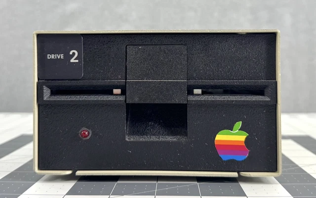
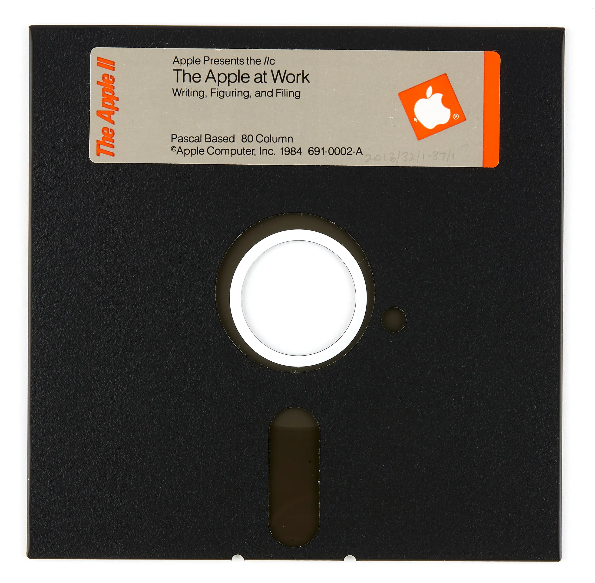

# POM2


**A modern Apple II emulator with the knobs exposed.**

POM2 emulates the Apple ][, ][+, //e, //c, and //c+ with Dear ImGui,
authentic video modes, expansion cards, floppy sounds, snapshots, disk
libraries, kiosk booting, and a browser build.

**Try it in your browser:** [https://habib256.github.io/POM2/wasm/](https://habib256.github.io/POM2/wasm/)

## Quick Start

```bash
./setup_imgui.sh
cd build && cmake .. && make -j
./run_emulator.sh
```

`setup_imgui.sh` supports macOS, Debian/Ubuntu, Fedora, and Arch. On
Windows, install GLFW through vcpkg and run CMake manually.

Apple ROMs are not bundled. Put files here:

```text
roms/         Apple II firmware dumps
disks_5.4/    5.25" disk images
disks_3.5/    3.5" disk images
hdv/          ProDOS hard-disk images
floppyemu/    Floppy Emu / BMOW media
```

Boot a disk directly:

```bash
POM2 path/to/game.woz
POM2 --kiosk path/to/game.dsk
```

POM2 routes supported images to Disk II, SmartPort, or ProDOS HDV using
your saved profile and slot configuration.

## Screenshots

| Disk II                                                        | Apple at Work                          |
| -------------------------------------------------------------- | -------------------------------------- |
|  |  |

## Features

| Area            | Highlights                                                                                                                          |
| --------------- | ----------------------------------------------------------------------------------------------------------------------------------- |
| **Machines**    | Apple ][, ][+, //e unenhanced, //e enhanced, //c, //c+.                                                                             |
| **CPU/Memory**  | NMOS 6502, 65C02, Rockwell/WDC opcodes, IIe paging, Language Card, aux LC, RamWorks III up to 8 MB.                                |
| **Video**       | Text, lo-res, hi-res, double hi-res, 80-column, composite NTSC, mono phosphor, Video-7 RGB, Le Chat Mauve RGB.                     |
| **Audio**       | Speaker, cassette, Mockingboard A/C, Mockingboard C Sound II, Phasor, SSI263 speech, Disk II / Sony 3.5" mechanical sounds.        |
| **Storage**     | `.dsk`, `.do`, `.po`, `.nib`, `.2mg`, `.woz`, `.hdv`, DOS 3.x, ProDOS, SmartPort, CFFA 2.0.                                       |
| **Peripherals** | Super Serial, printer spool, Grappler+, ProDOS Clock, Mouse Card, joystick, Floppy Emu, built-in //c devices.                      |
| **Tools**       | Disk Library, Slot Configuration, screenshots, memory viewer, snapshots, CLI, kiosk mode, AI-control HTTP server.                  |

## Machines

| Profile                     | CPU   | Main ROM probes                        |
| --------------------------- | ----- | -------------------------------------- |
| Apple ][ Original (1977)    | NMOS  | `apple2o.rom`, `apple2.rom`            |
| Apple ][+ (1979)            | NMOS  | `apple2p.rom`, `apple2.rom`            |
| Apple //e Unenhanced (1983) | NMOS  | `apple2e_unenh.rom`, `apple2e.rom`     |
| Apple //e Enhanced (1985)   | 65C02 | `apple2e.rom`                          |
| Apple //c (1984)            | 65C02 | `apple2c-32Kv0.rom`, `apple2c-16K.rom` |
| Apple //c+ (1988)           | 65C02 | `apple2cp.rom`, `apple2c-plus.rom`     |

Switch machines from `Machine -> Profile` or with:

```bash
POM2 --preset iie
POM2 --preset iic+
```

Switching profiles performs a cold reset, re-plugs built-in cards, and
re-mounts inserted disks where possible.

## ROMs And Media

Accepted main ROM sizes include 12 KB, 16 KB, 20 KB system packs with 4
KB filler, and 32 KB system+video ROMs.

| File                                 | Role                                       |
| ------------------------------------ | ------------------------------------------ |
| `apple2e.rom`                        | //e firmware plus optional charset         |
| `apple2cp.rom`                       | //c+ banks 0 + 1                           |
| `apple2_char.rom`                    | Character ROM                              |
| `disk2.rom` / `disk2_13.rom`         | Disk II boot PROMs                         |
| `diskii_p6.rom`                      | Disk II P6 LSS sequencer, required for WOZ |
| `cffa20ee02.bin` / `cffa20eec02.bin` | CFFA 2.0 firmware                          |
| `mouse_341-0270-c.bin`               | Mouse Card slot ROM                        |
| `mouse_341-0269.bin`                 | Mouse Card 68705 MCU mask ROM              |
| `roms/floppy_samples/*.wav`          | Mechanical drive samples                   |

Supported disk formats: `.dsk`, `.do`, `.po`, `.nib`, `.2mg`, `.2img`,
`.woz`, and `.hdv`. Detection is content-driven; MacBinary wrappers,
DOS/ProDOS skew, and WOZ/2IMG write-protect flags are handled.

## Expansion Cards

Use `Machine -> Slot Configuration` to assign cards, mount media, eject,
or boot.

| Key                 | Card                                      |
| ------------------- | ----------------------------------------- |
| `diskii`            | Disk II                                   |
| `hdv`               | ProDOS HDV                                |
| `cffa`              | CFFA 2.0 IDE                              |
| `smartport35`       | SmartPort 3.5"                            |
| `ssc`               | Super Serial Card                         |
| `printer`           | Parallel printer with host spool          |
| `grappler`          | Orange Micro Grappler+                    |
| `clock`             | ProDOS Clock / ThunderClock+              |
| `chatmauve`         | Le Chat Mauve RGB                         |
| `mouse` / `mouseaw` | Mouse Card                                |
| `mockingboard`      | Mockingboard A/C                          |
| `mockingboard_c`    | Mockingboard C Sound II with SSI263       |
| `phasor`            | Applied Engineering Phasor                |
| `echoplus`          | Cricket / Echo SSI263 line                |
| `echoplus_tms`      | Echo+ TMS5220 + 2x AY scaffold            |

Typical II / II+ / //e setup: slot 2 Super Serial, slot 4
Mockingboard/Phasor, slot 5 HDV or SmartPort, slot 6 Disk II, slot 7 Le
Chat Mauve RGB. On //c and //c+, built-in slots are locked.

## Keyboard And Joystick

| Host      | Apple II                        |
| --------- | ------------------------------- |
| Enter     | Return                          |
| Backspace | Left arrow                      |
| Arrows    | Apple II arrows                 |
| Esc       | ESC                             |
| Ctrl-A..Z | `$01..$1A`                      |
| Left Alt  | Open-Apple, `$C061`             |
| Right Alt | Solid-Apple, `$C062`            |
| F9        | Screenshot, `screenshot_NNN.ppm` |
| F11       | Soft reset / Ctrl-Reset         |
| F12       | Hard reset / power-cycle        |

GLFW gamepads are hot-plugged and auto-bound.

## CLI

```bash
POM2 <disk-image>
POM2 --kiosk <disk-image>
POM2 --preset ii|ii+|iie-u|iie|iic|iic+
POM2 --snapshot-save out.pom2snap
POM2 --snapshot-load in.pom2snap
```

Other useful flags: `--speed`, `--cpu-max`, `--tape`, `--35-disk1`,
`--35-disk2`, `--load`, `--run`, `--step`, `--paste`, `--play`, `--rec`,
and `--rewind`.

## WebAssembly

Live build: [https://habib256.github.io/POM2/wasm/](https://habib256.github.io/POM2/wasm/)

```bash
./build_wasm.sh
./build_wasm.sh --serve
./build_wasm.sh --with-data
```

The browser build preloads `roms/`, `fonts/`, `pic/`, and `floppyemu/`,
but user Apple ROMs are still required. Telnet and the AI-control HTTP
server are compiled out under WASM.

## Releases

```bash
./build_dist.sh
./build_dist.sh --tests
```

Linux packaging produces a relocatable tarball, a Debian package, and,
when `linuxdeploy` is available, an AppImage. Apple ROMs are never
bundled.

## Known Limitations

- Mouse absolute position can drift under A2Desktop / MGTK.
- Some anti-//e games refuse to boot on //e/c/c+ hardware.
- //c+ Sony 3.5" boot uses the built-in slot-5 SmartPort path; the full
  IWM bit-shift state machine is not yet modeled.

## Developer Notes

- [`DEV.md`](DEV.md) documents implementation details and parity notes.
- [`TODO.md`](TODO.md) tracks the active backlog.
- [`CHANGELOG.md`](CHANGELOG.md) explains resolved changes.

## License

GPL-3.0.
