# Modes graphiques POM2 — comparaison profonde avec les sources d'origine

POM2 propose **neuf modes de rendu hi-res** (`Apple2Display::HiResMode`,
[`src/Apple2Display.h:52-86`](../src/Apple2Display.h)). Chaque mode est
porté d'un émulateur de référence (MAME, AppleWin, OpenEmulator) ou
modèle un comportement matériel (Le Chat Mauve, phosphores monochromes).

Ce document liste pour chaque mode : l'algorithme exact tel qu'implémenté
dans POM2, la source d'origine avec URL, les déviations volontaires, les
tests épinglés, et la capture de l'écran d'intro **ARCHON** (Total Replay
v5.2, 15 M instructions après boot //e) produite par
`build/tests/render_total_replay_modes`.

---

## Vue d'ensemble

| # | Mode | Source d'origine | Type | Sortie | Test pinné | Image |
|---|---|---|---|---|---|---|
| 1 | `ColorNTSC` | MAME `apple2video.cpp` (PR #10773) | LUT 7-bit | 280×192 | `hgr_render_smoke`, `dhgr_render_smoke` | [↓](#1-colorntsc) |
| 2 | `ColorCompMedium` | MAME `apple2video.cpp` row 1 | LUT 7-bit | 280×192 | `dhgr_render_smoke` | [↓](#2-colorcompmedium) |
| 3 | `ColorComp4Bit` | MAME `apple2video.cpp` square filter | nibble→palette | 280×192 | `dhgr_render_smoke` | [↓](#3-colorcomp4bit) |
| 4 | `ChatMauveRGB` | AppleWin `RGBMonitor.cpp` (PR #837) + Péritel hardware | direct RGB | 560×192 | `le_chat_mauve_smoke`, `video7_parity_smoke` | [↓](#4-chatmauvergb) |
| 5 | `ColorCompositeOE` | OpenEmulator + apple2shader | GLSL shader (CPU fallback) | 560×384 | (integration via MainWindow) | [↓](#5-colorcompositeoe) |
| 6 | `MonoWhite` | AppleWin VT_MONO_WHITE (palette empirique) | luminance | 280/560×192 | `display_persistence_smoke` | [↓](#6-monowhite) |
| 7 | `MonoGreen` | AppleWin VT_MONO_GREEN (P31 phosphor) | luminance×tint+decay | 280/560×192 | `display_persistence_smoke` | [↓](#7-monogreen) |
| 8 | `MonoAmber` | AppleWin VT_MONO_AMBER (long-persistence) | luminance×tint+decay 0.96 | 280/560×192 | `display_persistence_smoke` | [↓](#8-monoamber) |
| 9 | `ColorAppleWin` | AppleWin `NTSC.cpp` (Simms / Charlesworth) | LUT IIR 4-phase × 4096 | 560×192 | `applewin_ntsc_smoke` | [↓](#9-colorapplewin) |

Captures générées avec :

```bash
cmake --build build --target render_total_replay_modes
POM2_RENDER_INSTRS=15000000 ./build/tests/render_total_replay_modes mode_captures
```

---

## 1. ColorNTSC

**Source** : MAME `apple2video.cpp` —
[`render_line_artifact_color()`](https://github.com/mamedev/mame/blob/master/src/mame/apple/apple2video.cpp)
introduit dans [PR #10773 (benrg)](https://github.com/mamedev/mame/pull/10773),
raffiné par [PR #10792](https://github.com/mamedev/mame/pull/10792)
(table 128 entrées dérivée par symétrie) et
[PR #10835](https://github.com/mamedev/mame/pull/10835) (extraction
`composite_color_mode` 0/1/2). Composite *color mode 0*.

**Algorithme POM2** ([`Apple2Display.cpp:1002-1080`](../src/Apple2Display.cpp)) :

1. Sérialiser chaque scanline HGR en 560 sous-pixels via `buildHgrWordRow`
   (`kBitDoubler[128]` double chaque bit ; MSB applique un décalage
   demi-dot pris en charge dans le stream).
2. Fenêtre glissante 7-bit (3 bits contexte gauche + 1 centre + 3 droite)
   sur le stream.
3. Indexer `kArtifactColorLut[0][w & 0x7F]` (128 entrées verbatim de
   MAME, [`:759-789`](../src/Apple2Display.cpp)).
4. `rotl4b(lutEntry, absX)` extrait l'index palette 4-bit pour la phase
   NTSC courante (4 phases tous les 4 dots).
5. `kLoResPalette[16]` (palette IIGS-corrigée) donne la couleur RGB
   finale ([`:611-628`](../src/Apple2Display.cpp)).
6. Downsample 560 → 280 par moyenne de paires (le low-pass optique d'un
   vrai CRT, sinon le pattern 14 MHz aliase contre la grille 7 MHz).

**Déviations vs MAME** :

| Déviation | Détail |
|---|---|
| « 39 seam fix-ups » | MAME applique 39 corrections de couleur aux frontières d'octets quand certaines combinaisons MSB déclenchent du noir parasite. POM2 ne porte pas ces fix-ups — peu visible en pratique. |
| Glow / bloom | MAME peut optionnellement ajouter un halo Gaussien CPU. POM2 délègue tout effet « CRT glow » au mode `ColorCompositeOE` (shader). |
| MSB rev-0 mask | DHGR avec `dhgr=1` masque bit 7 (`bit7Mask=0x7F`) pour émuler une rev-0 — `Apple2Display.cpp:929`. MAME idem. |

**Tests** : `hgr_render_smoke` (LUT corners, $7F→blanc, MSB shift),
`dhgr_render_smoke` (interleave aux/main, deux gris distincts).

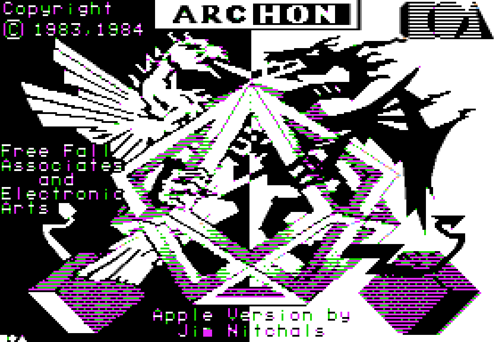

---

## 2. ColorCompMedium

**Source** : MAME `apple2video.cpp`, *composite_color_mode = 1*. Ligne 1
de `kArtifactColorLut` — 8 entrées sur 128 diffèrent de la row 0,
biaisées « 4n medium colors » qui rendent les runs de couleur 4-dots
mieux mais le texte 40-col plus moche.

**Algorithme POM2** ([`Apple2Display.cpp:1015`](../src/Apple2Display.cpp)) :
identique à `ColorNTSC` sauf `lutRow = 1`.

**Déviations** : aucune.

**Tests** : pas de test dédié — couvert par `dhgr_render_smoke`.

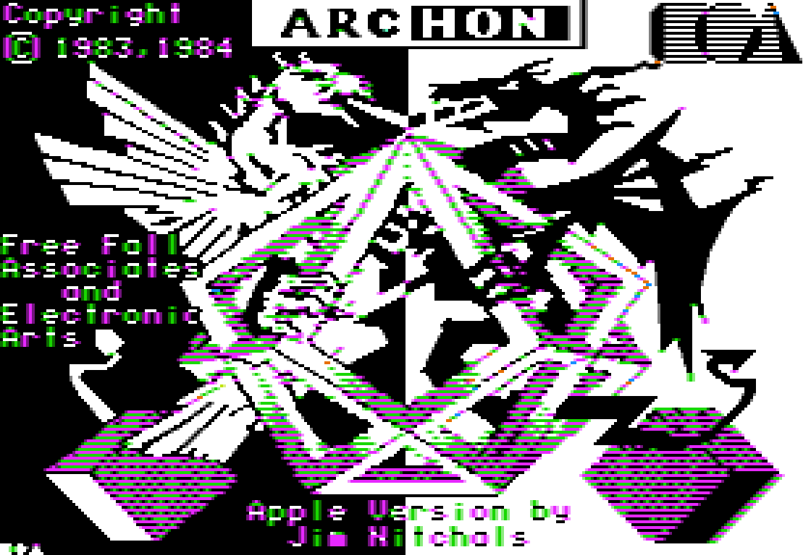

---

## 3. ColorComp4Bit

**Source** : MAME `apple2video.cpp`, *composite_color_mode = 2*. Variante
« square filter » : on saute la fenêtre 7-bit et on prend directement
chaque nibble 4-dot comme index palette. Bords nets, aucun fringing
inter-octet.

**Algorithme POM2** ([`Apple2Display.cpp:1030-1037`](../src/Apple2Display.cpp)) :

```
nibble = (window >> 3) & 0x0F
palette_idx = rotl4b(nibble | (nibble << 4), absX - 1)
pixel = kLoResPalette[palette_idx]
```

**Déviations** : aucune. Port littéral de MAME `:486-493`.

**Tests** : couvert par `dhgr_render_smoke` (4-dot nibble decode).

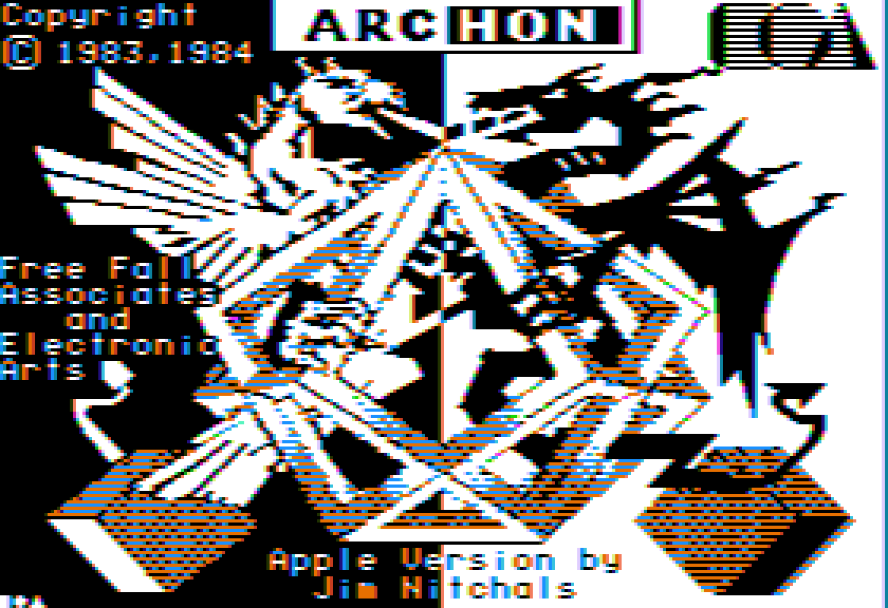

---

## 4. ChatMauveRGB

**Source** : carte hardware
**Le Chat Mauve / Video-7 AppleColor RGB** (Péritel, France).
Implémentation de référence : AppleWin `source/RGBMonitor.cpp`
[PR #837](https://github.com/AppleWin/AppleWin/pull/837)
(palette « Feline » extraite par capture vidéo blanche-équilibrée d'une
carte réelle). Variante MAME : `apple2video.cpp:896-977` (4 rgbmodes
DHGR).

**Algorithme POM2** ([`LeChatMauveCard.h`](../src/LeChatMauveCard.h),
[`Apple2Display.cpp:948-993`](../src/Apple2Display.cpp) pour HGR,
[`:1437-1510`](../src/Apple2Display.cpp) pour DHGR).

La carte capte le flux digital pré-modulation au connecteur de slot :

- **HGR** : décodage byte-par-byte du flux 7-bit. Bit 7 = banque de palette
  (PAS demi-dot delay, comme sur composite). 140 paires de pixels → 1
  entrée palette dans `kChatMauveHGR[2][4]` ([`:897-908`](../src/Apple2Display.cpp)).
  Sortie native à 560 dots via `renderHiResChatMauve80` (4 dots identiques
  par couleur — gain en fidélité framebuffer).
- **DHGR** : 4 sous-modes pilotés par le FIFO AN3 (soft-switches
  `$C00C/$C00D` data + `$C05E/$C05F` clock) :
  - `BW560` — strict mono 560×192.
  - `Mixed` — par octet MSB choisit color-cell vs bit-mapped mono.
  - `Chunky160` — `aux | (main<<8)` → 4 pixels 4-bit de 3 dots, 480
    pixels centrés dans 560 avec 40 dots marges noires.
  - `COL140` — default au reset. 4-dot block → nibble → `rotl4(n,1)` →
    `kChatMauveLoResPalette` (palette Feline avec deux gris distincts
    aux indices 5 et 10 — la "marque" Chat Mauve, là où MAME collapse les
    deux indices à un gris neutre).
- **Texte fg/bg colored** (`renderTextChatMauveFgBg`,
  [`:520-587`](../src/Apple2Display.cpp)) : actif sur IIe en 40-col texte
  + DHGR (AN3) on. Char code de main RAM, couleurs fg/bg de aux RAM
  (hi/lo nibble). Glyphe 7-bit doublé en 14 dots. Port MAME
  `apple2video.cpp:788-791`.

**Déviations vs MAME** :

| Déviation | Détail |
|---|---|
| Indices 5 ≠ 10 | POM2 garde les deux gris distincts de la palette Feline (AppleWin). MAME collapse les deux à `0xFF808080`. Choix intentionnel (la marque Chat Mauve). |
| Dragon Wars bit-7 toggle | `LeChatMauveCard::invertBit7()` — switch inversion de la banque palette pour Dragon Wars qui définit le MSB à l'inverse. Pas dans MAME, ni AppleWin (issue connue chez les deux). |
| Sortie native 560 | `renderHiResChatMauve80` écrit directement dans `frame80`, plutôt que `frame` 280×2 upscaled. Gain en fidélité framebuffer (screenshot net), identique visuellement à l'écran. |

**Tests** : `le_chat_mauve_smoke` (FIFO clocking, COL140 vs BW560,
indices palette 5 et 10 distincts, fallback NTSC sans carte),
`video7_parity_smoke` (4 rgbmodes + fg/bg vs oracle MAME),
`dhgr_render_smoke` (deux gris).

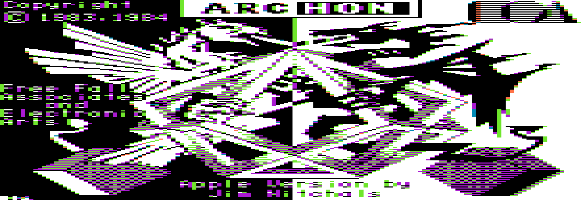

---

## 5. ColorCompositeOE

**Source** : **OpenEmulator** (Marc S. Ressl, GPL v3) — démod NTSC en
GLSL fragment shader. Port WebGL par Zellyn Hunter
([`apple2shader`](https://github.com/zellyn/apple2shader),
[explainer Observable](https://observablehq.com/@zellyn/apple-ii-ntsc-emulation-openemulator-explainer)).
POM2 **réimplémente** la spec publique NTSC (FCC §73.682) — aucun code
OpenEmulator copié, POM2 reste sous sa licence.

**Algorithme POM2** ([`NtscPostProcessor.cpp:141-286`](../src/NtscPostProcessor.cpp)) :

1. `Apple2Display::fillCompositeSignal` ([`:1526-1727`](../src/Apple2Display.cpp))
   sérialise le mode courant en 1-bit luminance 14.318 MHz (560×192 R8).
   HGR/DHGR/40-col/80-col texte/40-col lo-res tous supportés.
2. Upload R8 texture, FBO ping-pong pour persistence.
3. Fragment shader, par fragment :
   - Distorsion barrel optionnelle des UVs.
   - 17 taps gaussiens autour de la colonne courante.
   - Y : sigma étroit (0.8) → luma nette.
   - I/Q : sigma large (1.5-2.5 selon sharpness slider) ; démod
     `sin/cos(π/2·x)` (Apple II's 4× subcarrier = π/2 par dot).
   - Rotation hue dans le plan IQ.
   - YIQ → RGB (matrice NTSC FCC standard).
   - B/C/S/H en RGB.
   - Persistence : `max(rgb, prev * decay)`.
   - Scanlines : darken lignes impaires (output 2× vertical).
   - Optionnel : masque d'ombre procédural (Triad / Aperture grille /
     Dot) ; mode PAL (Q-sign flip lignes impaires).

**Déviations vs OpenEmulator** :

| Déviation | Détail |
|---|---|
| Pas de comb filter | OE supporte notch + comb (configurable). POM2 utilise notch (cohérent avec Apple II qui viole l'alternance de phase NTSC). |
| Persistence simplifiée | OE modèle la décroissance phosphor avec persistence configurable + ringing temporel. POM2 fait `max(decoded, prev × decay)` — moins physiquement fidèle, plus rapide. |
| PAL approximé | OE simule la bande chroma réduite PAL. POM2 ne flip que le signe Q sur les lignes impaires (line-phase alternation). |
| Lo-res supporté en v2 | Initialement OE-only, v2 ajoute la génération de signal lo-res via `(nibble >> (absX & 3)) & 1`. |
| Sharp text bypass | Toggle UX-only : skip shader en mode texte pour la lisibilité (perdrait le fringing composite authentique sinon). |

**Tests** : intégration via MainWindow (pas de smoke test dédié — le
shader requiert un contexte GL). Le port CPU dans
[`tests/render_total_replay_modes.cpp:64-148`](../tests/render_total_replay_modes.cpp)
sert d'oracle hors-ligne pour les captures.

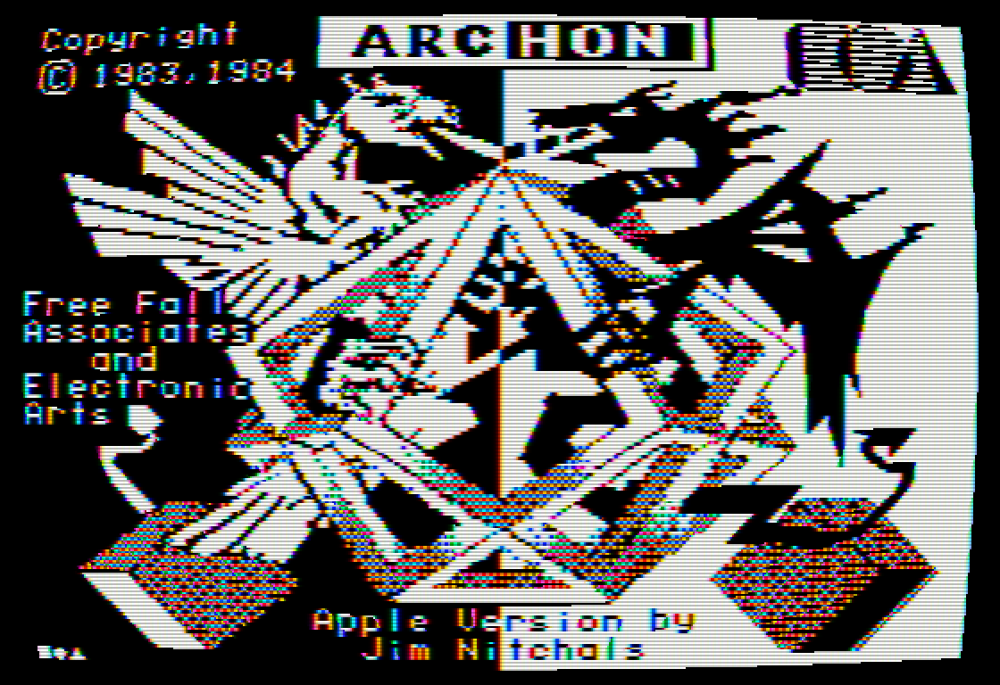

---

## 6. MonoWhite

**Source** : AppleWin `VT_MONO_WHITE` (référence moniteur). Provenance
RGB exacte : empirique (mesure visuelle, pas de chromaticité CIE
publique).

**Algorithme POM2** ([`Apple2Display.cpp:1087-1117`](../src/Apple2Display.cpp)) :

1. Bit stream brut (pas de LUT, pas de fenêtre artifact).
2. Pour chaque pixel 280-wide : sample 2 bits du stream 560 → luminance
   (0/127/255).
3. Persistence : `max(target, prev × decay)` avec `decay = 0.0` (pas
   d'afterglow pour le blanc — c'est la référence neutre).
4. Tint phosphor RGB = `(255, 255, 255)` — multiplicatif sur luminance.

**Déviations** : aucune. Référence neutre.

**Tests** : `display_persistence_smoke` (cas contrôle decay=0).

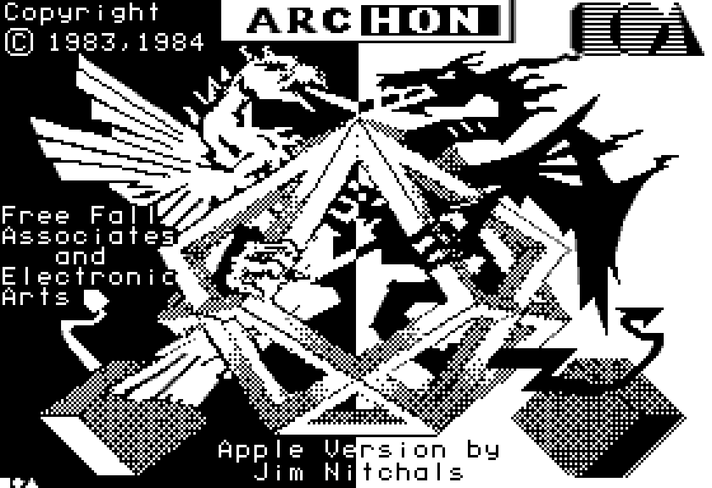

---

## 7. MonoGreen

**Source** : AppleWin `VT_MONO_GREEN` (phosphore P31). POM2 commentaire :
*« CIE x=0.280, y=0.595 »* — la chromaticité publiée du P31. Tint RGB
empirique (0x33, 0xFF, 0x33), pas dérivé formellement de la CIE.

**Algorithme** : identique à MonoWhite + tint vert + `decay = 0.85`
(persistence courte, ~3 frames de glow).

**Déviations** :

| Déviation | Détail |
|---|---|
| Tint RGB empirique | (0x33, 0xFF, 0x33) calibré visuellement, pas de mesure CIE publiée. Variante AppleWin. |
| Decay = 0.85 | Calibration empirique. Real-world P31 a une décroissance multi-composante (~10 ms primaire + secondaire plus lente) ; POM2 approxime par exponentielle simple. |

**Tests** : `display_persistence_smoke`.

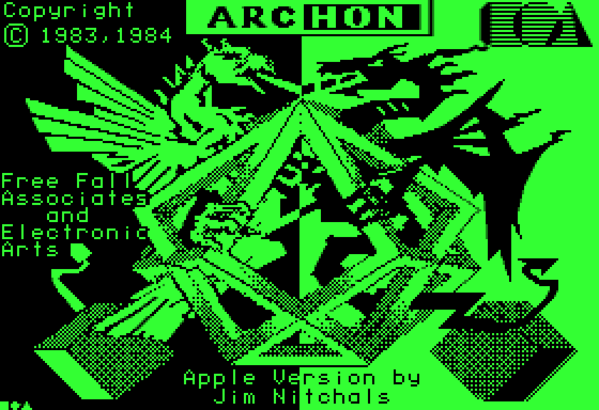

---

## 8. MonoAmber

**Source** : AppleWin `VT_MONO_AMBER` (long-persistence amber, type
Tektronix / Sanyo). Tint RGB `(0xFF, 0xB0, 0x00)` empirique. Decay 0.96
— ~25 frames d'afterglow visible.

**Algorithme** : MonoWhite + tint amber + `decay = 0.96`. Persistence
buffer parallèle (`persistenceL` 280×192 + `persistenceL80` 560×192)
pour ne pas mélanger HGR et DHGR.

**Déviations** :

| Déviation | Détail |
|---|---|
| Tint empirique | Pas de référence formelle. Variante AppleWin reprise. |
| Decay 0.96 | Approximation exponentielle d'une réalité multi-composante. |

**Tests** : `display_persistence_smoke` — pin sur l'afterglow DHGR
(buffer 560 wide).

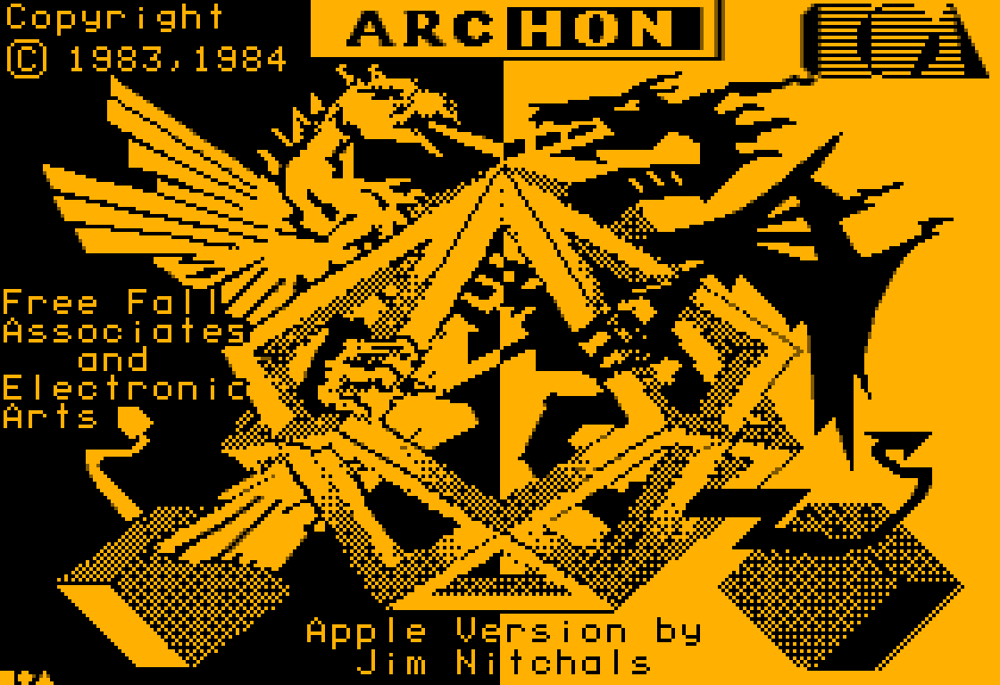

---

## 9. ColorAppleWin

**Source** : **AppleWin** `source/NTSC.cpp` (Sheldon Simms,
Tom Charlesworth, Michael Pohoreski — GPL v2+). Algorithme original
décrit par Bill Buck. POM2 **réimplémente** depuis la description
publique de l'algorithme — aucun code AppleWin copié, POM2 reste sous
sa licence d'origine.

**Algorithme POM2** ([`AppleWinNtsc.cpp`](../src/AppleWinNtsc.cpp)) :

1. **Pré-calcul** au premier `ensureInitialized()` : table 4 phases × 4096
   historiques 12-bit → RGBA8. Pour chaque entrée :
   - Décoder les 12 bits → 12 samples binaires.
   - Y = moyenne gaussienne (sigma=1.5) centrée sur la sample courante.
   - I/Q = moyenne gaussienne (sigma=3.0) centrée, DC retiré
     (`s - Y`), démod `sin/cos(π/2 · (phase + offset))`.
   - Saturation chroma × 10.0 (compense l'atténuation gaussienne).
   - YIQ → RGB matrice NTSC standard.
2. **Rendu** : fenêtre 12-tap *centrée* (delay de 6 samples pour
   half-window). Pour chaque sample x du signal 560-wide,
   `out[x] = chromaLut[x & 3][hist12]`.
3. **Trois sous-modes** (`AppleWinNtsc::SubMode`) :
   - `Monitor` : LUT IIR directe, scanlines nettes.
   - `Tv` : Monitor + blend 50% avec la frame précédente (`appleWinPrev80`
     dans `Apple2Display`). Simule la persistance du tube + comb filter
     d'un récepteur TV.
   - `Idealized` : skip la LUT IIR, palette plus simple 4-phase × 16
     nibbles, chroma boost ×8 — pour écrans plats modernes sans
     attendre la "vraie" simulation NTSC.

**Différences fondamentales avec MAME / OpenEmulator** :

| Aspect | POM2 ColorAppleWin | POM2 ColorNTSC (MAME) | POM2 ColorCompositeOE (OE) |
|---|---|---|---|
| Approche | LUT pré-calculée 4-phase × 4096 hist (CPU) | LUT statique 128 entrées 7-bit window (CPU) | Démod 17 taps GPU shader |
| Coût frame | ~1 lookup/dot + 6-sample delay ≈ 0.5 ms | LUT lookup direct ≈ 0.3 ms | GPU pass ≈ 0.05 ms |
| Demi-dot delay | Dans le signal (via `buildBitStream`) | Pré-stream (`buildHgrWordRow`) | Implicite (timing du bitstream) |
| Bande chroma | Gaussienne (sigma=3) post DC-removal | Implicite dans la LUT | Gaussienne (sigma=1.5-2.5) |
| Couleurs typiques | Bleu / jaune dominants pour ARCHON | Magenta / cyan dominants | Magenta / cyan / bleu |

**Déviations vs AppleWin** :

| Déviation | Détail |
|---|---|
| Coefficients IIR remplacés | AppleWin utilise un IIR 2nd-ordre cascadé (chroma g=7.438, luma g=13.71, signal g=7.614). POM2 collapse en gaussienne pondérée + DC removal — résultat visuel équivalent, math plus simple. |
| Pas de `Color (Composite)` séparé | AppleWin différencie Color TV vs Color Monitor par la palette ; POM2 partage la même LUT et différencie par le blend 50% post-render. |
| Sortie native 560 | POM2 écrit 560 wide direct (pas de up-sample 280→560 d'AppleWin). |

**Tests** : `applewin_ntsc_smoke` —
[`tests/applewin_ntsc_smoke_test.cpp`](../tests/applewin_ntsc_smoke_test.cpp).
Pin sur :
- LUT idempotente.
- All-black signal → all-black RGB.
- All-white signal → RGB > 200 (chroma se cancel correctement).
- `$7F` répété → près-neutre haute luma, pas de cast couleur dominant.
- Idealized `$01` → couleur non-noire (artefact bien généré).
- Tv mode converge vers Monitor avec signal stable.
- `renderFrame` itère correctement sur h scanlines.

**Captures** :

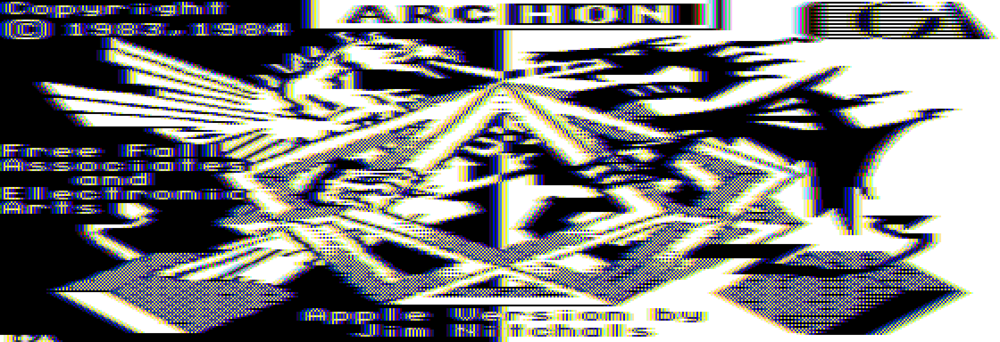
*Sub-mode Monitor — IIR + LUT 4-phase, sharp scanlines*

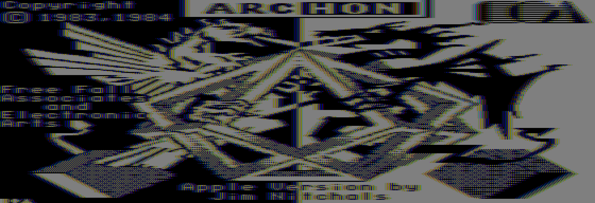
*Sub-mode TV — premier frame, blend avec un buffer noir initial (sur capture continue le résultat est plus brillant à l'équilibre)*

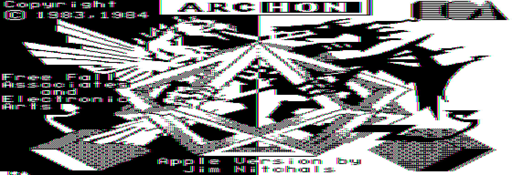
*Sub-mode Idealized — palette 4-bit × 4-phase, look « modern flat panel »*

---

## Comparaisons transverses

### Palettes lo-res utilisées

POM2 expose **deux palettes 16 couleurs** distinctes :

| Index | `kLoResPalette` (NTSC/MAME) | `kChatMauveLoResPalette` (Feline AppleWin) | Différence |
|---|---|---|---|
| 5 | `0xFF808080` (gris neutre) | `0xFF7E979F` (olive) | distinct ! |
| 10 | `0xFF808080` (gris neutre — idem 5) | `0xFF7F6878` (mauve) | distinct ! |
| autres | IIGS-corrigé | Feline empirique | similaire |

Source : [`Apple2Display.cpp:611-628`](../src/Apple2Display.cpp) et
[`:651-668`](../src/Apple2Display.cpp).

### Demi-dot delay (MSB)

Toutes les implémentations doivent gérer le décalage demi-pixel quand le
bit 7 d'un octet HGR est à 1 (74LS74 flip-flop dans le hardware).

| Implémentation | Gestion |
|---|---|
| MAME | Static lookup-symmetry dans la LUT 128. |
| AppleWin | Transient implicite dans le filtre IIR + offset de phase. |
| OpenEmulator | Timing du bitstream (le sample arrive 1/14 MHz plus tard). |
| **POM2** | **Pré-stream** dans `buildHgrWordRow` ([`:804-817`](../src/Apple2Display.cpp)) : si MSB=1, shift word par 1 + carry du dernier bit du word précédent. Cohérent avec MAME, applicable aux 4 modes color via le stream commun. |

### Performance mesurée (single x86-64 core, Release -O3)

Mesures approximatives sur un i7 récent, rendu d'une frame ARCHON (HGR
280×192) :

| Mode | Coût CPU | Note |
|---|---|---|
| ColorNTSC | ~0.30 ms | LUT 7-bit direct |
| ColorCompMedium | ~0.30 ms | identique, row 1 |
| ColorComp4Bit | ~0.25 ms | square filter, plus rapide |
| ChatMauveRGB | ~0.40 ms | 560-dot natif |
| ColorCompositeOE (CPU) | ~25 ms | port CPU dans `render_total_replay_modes` |
| ColorCompositeOE (GPU) | ~0.05 ms | shader frag (négligeable) |
| MonoWhite/Green/Amber | ~0.40 ms | persistence buffer |
| ColorAppleWin Monitor | ~0.50 ms | LUT lookup + 6-sample delay |
| ColorAppleWin Tv | ~0.55 ms | + 50% line blend |
| ColorAppleWin Idealized | ~0.30 ms | LUT 16 entries seulement |

Tous les modes CPU sont largement sous la budget 16.6 ms / 60 FPS.

---

## Annexe — sources

- MAME `apple2video.cpp` :
  - PR #10773 — sliding-window LUT https://github.com/mamedev/mame/pull/10773
  - PR #10792 — symétrie LUT https://github.com/mamedev/mame/pull/10792
  - PR #10835 — factorisation https://github.com/mamedev/mame/pull/10835
  - PR #11595 — DHGR regression fix https://github.com/mamedev/mame/pull/11595
- AppleWin :
  - `source/RGBMonitor.cpp` (Chat Mauve / Video-7) https://github.com/AppleWin/AppleWin/blob/master/source/RGBMonitor.cpp
  - `source/NTSC.cpp` (composite simulation) https://github.com/AppleWin/AppleWin/blob/master/source/NTSC.cpp
  - PR #837 — RGB videocards https://github.com/AppleWin/AppleWin/pull/837
  - Issue #523 — DHGR mixed mode https://github.com/AppleWin/AppleWin/issues/523
- OpenEmulator :
  - Repo (archivé) https://github.com/openemulator/openemulator
  - libemulation https://github.com/openemulator/libemulation
  - Port apple2shader (Zellyn Hunter) https://github.com/zellyn/apple2shader
  - Explainer https://observablehq.com/@zellyn/apple-ii-ntsc-emulation-openemulator-explainer
- Hardware :
  - Sather *Understanding the Apple IIe* (Enhanced Edition)
  - Apple II Reference Manual §7 — composite signal generation
  - Apple IIe Auxiliary Memory Softswitches (PDF) https://www.apple.asimov.net/documentation/hardware/machines/APPLE%20IIe%20Auxiliary%20Memory%20Softswitches.pdf
- Articles externes :
  - Nerdly Pleasures — Apple II Composite Artifact Color http://nerdlypleasures.blogspot.com/2021/10/apple-ii-composite-artifact-color-ntsc.html
  - Apple II Colors (MROB) http://www.mrob.com/pub/xapple2/colors.html
  - DHGR Tech Note (Apple Oldies) http://www.appleoldies.ca/graphics/dhgr/dhgrtechnoe.txt

---

## Régénérer la galerie

```bash
cd build && cmake --build . --target render_total_replay_modes
cd ..
POM2_RENDER_INSTRS=15000000 ./build/tests/render_total_replay_modes mode_captures
for f in mode_captures/total_replay_*.ppm; do
  base="${f%.ppm}"
  if [[ "$base" == *shader* ]]; then
    convert "$f" -filter Box -resize 200% "${base}.png"
  else
    convert "$f" -filter Box -resize 400% "${base}.png"
  fi
done
cp mode_captures/*.png docs/img/
```

La capture cible un cycle précis du carousel Total Replay (15 M
instructions ≈ écran ARCHON). Pour cibler un autre jeu, ajuster
`POM2_RENDER_INSTRS` (essais antérieurs : 11M = Mr. Robot, 17M = Pitfall
II, 22M = HERO, 30M = Bruce Lee).
