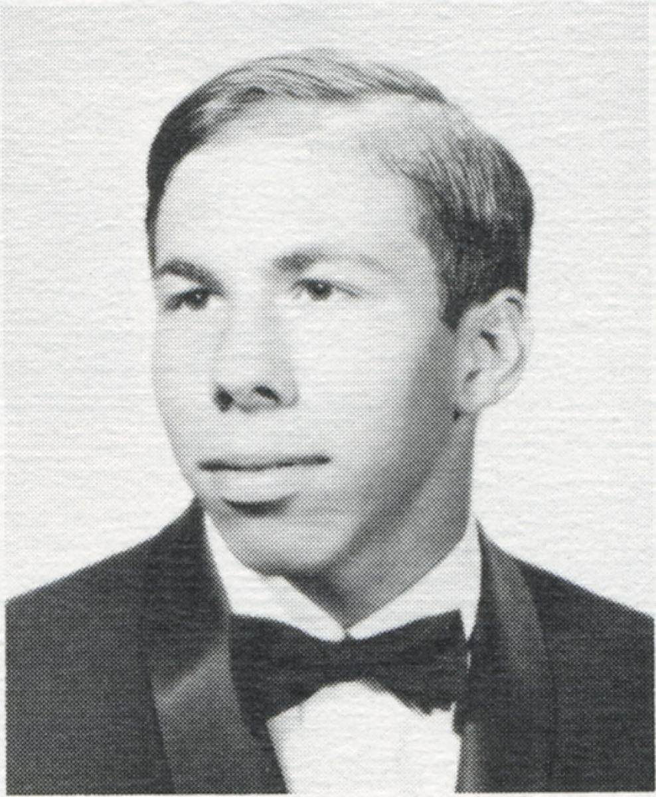
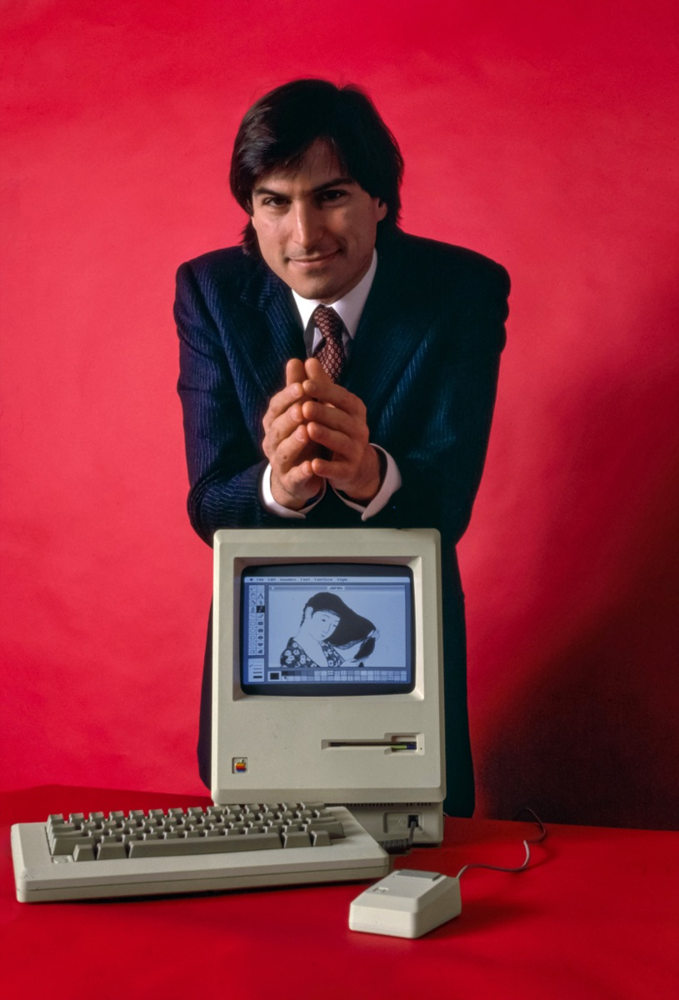
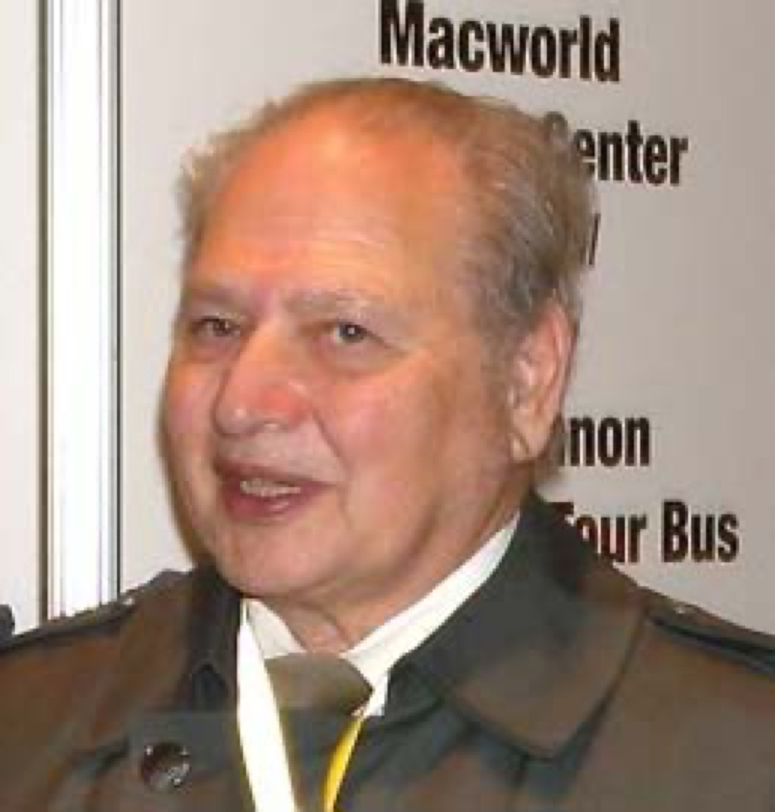
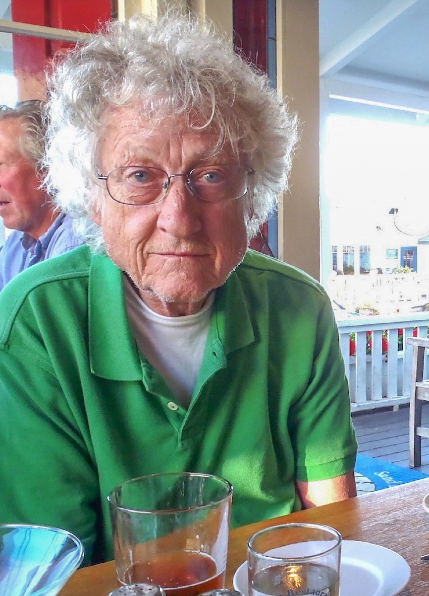
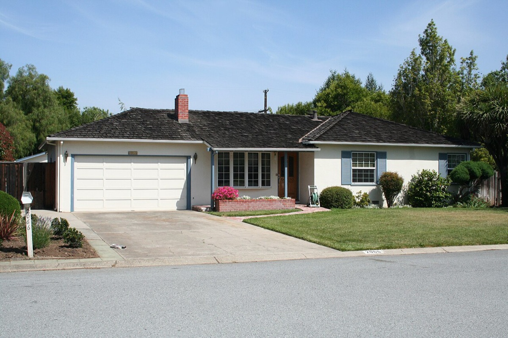

# QCM — L’Apple II, une histoire de personnes

Ce QCM ne cherche pas à réciter les caractéristiques d’une machine. Il raconte une création collective : des amitiés, des compétences complémentaires, des risques financiers, des délais serrés et un accident qui a bouleversé une trajectoire.

## Consigne

Choisir une seule réponse par question. Les images sont facultatives : elles illustrent le parcours des personnes, mais aucune réponse ne dépend de leur perception. Aucun prérequis technique sur l’architecture de l’Apple II n’est nécessaire.

## Partie 1 — Identifier les acteurs et leurs rôles

*Steve Wozniak en 1968 — Homestead High School, domaine public. Crédits complets : [CREDITS.md](apple_ii_history_assets/CREDITS.md).*

### 1. Quelle répartition décrit le mieux les rôles de Steve Wozniak et Steve Jobs au début d’Apple ?

A. Wozniak dirigeait la publicité et Jobs dessinait seul les circuits.  
B. Wozniak concevait principalement l’ordinateur ; Jobs poussait sa commercialisation et l’identité d’Apple.  
C. Tous deux travaillaient uniquement à l’assemblage, sans rôle distinct.  
D. Jobs finançait seul l’entreprise et Wozniak n’intervenait qu’après 1980.

### 2. Avant Apple, quelle expérience montrait déjà la complémentarité des deux Steve ?

A. Ils avaient ouvert ensemble une chaîne de magasins.  
B. Ils avaient conçu et vendu des « blue boxes » exploitant illicitement le réseau téléphonique pour passer des appels interurbains gratuits.  
C. Ils avaient créé le tableur VisiCalc.  
D. Ils avaient dirigé le Homebrew Computer Club.

### 3. Quel rôle le Homebrew Computer Club a-t-il joué dans leur histoire ?

A. C’était une banque qui leur accordait des prêts.  
B. C’était un service interne de Hewlett-Packard.  
C. C’était une communauté de passionnés où Wozniak présentait et discutait ses travaux avec d’autres amateurs.  
D. C’était l’usine chargée de fabriquer l’Apple II.

### 4. Qu’ont vendu Jobs et Wozniak pour contribuer au financement de leurs débuts ?

A. Jobs, son combi Volkswagen ; Wozniak, sa calculatrice programmable HP-65.  
B. Jobs, sa calculatrice HP-65 ; Wozniak, son combi Volkswagen.  
C. Tous deux empruntèrent la somme entière à Mike Markkula avant de le rencontrer.  
D. Ronald Wayne finança seul les composants en échange de sa participation de 10 %.

### 5. Pourquoi la commande de Paul Terrell pour le Byte Shop fut-elle décisive ?

A. Elle demandait uniquement des circuits imprimés nus, sans assemblage ni test.  
B. Elle portait sur cinquante cartes Apple-1 assemblées et testées — encore sans alimentation, clavier ni moniteur — et imposait un engagement commercial risqué.  
C. Elle fut passée après le lancement de l’Apple II et servit uniquement à financer sa publicité.  
D. Elle resta une promesse informelle, sans quantité, condition de livraison ni paiement prévu.

## Partie 2 — Relier les contributions au projet collectif

*Steve Jobs en 1984 — Bernard Gotfryd, domaine public. Cette photographie postérieure illustre sa trajectoire, pas le lancement de 1977.*

*Ronald Wayne en 2009 — Aljawad/Nightscream, CC BY-SA 3.0.*

### 6. Quel rôle Ronald Wayne joua-t-il lors de la fondation d’Apple ?

A. Il fut brièvement le troisième cofondateur, détenteur de 10 %, et dessina le premier logo représentant Newton.  
B. Il fut l’investisseur qui apporta fonds, crédit et expérience de gestion.  
C. Il fut le designer chargé du boîtier en plastique de l’Apple II.  
D. Il fut le commerçant du Byte Shop qui commanda cinquante Apple-1.

### 7. Pourquoi Ronald Wayne se retira-t-il très rapidement de la société ?

A. Hewlett-Packard avait refusé à plusieurs reprises de reprendre la conception de l’ordinateur.  
B. Après l’échec d’une entreprise antérieure, il redoutait notamment sa responsabilité personnelle face aux dettes du partenariat.  
C. Un accident d’avion l’avait conduit à prendre temporairement congé d’Apple.  
D. Un conflit avec la direction et le conseil d’administration l’avait poussé à quitter Apple en 1985.

### 8. Quelle contribution de Mike Markkula fut déterminante ?

A. Il apporta des fonds personnels, obtint une ligne de crédit et fournit l’expérience de gestion nécessaire pour transformer le partenariat initial en entreprise structurée.  
B. Il conçut le boîtier en plastique qui donna à l’Apple II l’apparence d’un produit fini.  
C. Il développa l’alimentation à découpage compacte de l’Apple II.  
D. Il passa la première commande commerciale importante au nom du Byte Shop.

### 9. Pourquoi le travail du designer Jerry Manock comptait-il dans le projet Apple II ?

A. Il conçut un boîtier en plastique donnant au produit l’apparence d’un objet fini pour la maison ou le bureau.  
B. Il développa l’alimentation à découpage et contribua à l’interface télévisuelle.  
C. Il rédigea l’accord du partenariat initial et dessina le logo de Newton.  
D. Il écrivit avec un autre lycéen les programmes de démonstration préparés pour la Computer Faire.

*Rod Holt en 2024 — Knvoutyras, CC BY 4.0.*

### 10. Quelle contribution Rod Holt apporta-t-il à l’Apple II ?

A. Il conçut notamment une alimentation à découpage compacte et fiable.  
B. Il conçut le boîtier en plastique beige de l’Apple II.  
C. Il apporta les fonds et la ligne de crédit qui structurèrent la jeune société.  
D. Il écrivit les programmes de démonstration de couleur et de son avec Randy Wigginton.

### 11. Que faisaient Chris Espinosa et Randy Wigginton à l’approche de la première West Coast Computer Faire ?

A. Ces deux lycéens, jeunes collaborateurs d’Apple, avaient écrit des programmes de démonstration et les dupliquaient sur cassette.  
B. Ils négociaient avec Paul Terrell les conditions de la première commande du Byte Shop.  
C. Ils concevaient respectivement l’alimentation et le boîtier de l’Apple II.  
D. Ils négociaient le financement et la ligne de crédit nécessaires à l’incorporation.

## Partie 3 — Analyser les contraintes, les épreuves et les récits

### 12. Que révèle la préparation de la West Coast Computer Faire d’avril 1977 ?

A. Le produit était achevé plusieurs mois à l’avance et ne rencontra aucun incident matériel avant la présentation.  
B. Une petite équipe travaillait dans l’urgence, entre une panne de clavier liée à l’électricité statique, des imperfections de boîtiers et des cassettes de démonstration à dupliquer.  
C. L’équipe préparait encore uniquement l’Apple-1 et ne comptait pas présenter l’Apple II lors de la manifestation.  
D. La préparation fut entièrement confiée à une agence extérieure, sans intervention des jeunes collaborateurs d’Apple.

*Maison de la famille Jobs — Mathieu Thouvenin, CC BY-SA 2.0.*

### 13. Quelle formulation rend le mieux compte du fameux « garage Apple » ?

A. L’Apple II fut intégralement conçu et fabriqué dans le garage par Jobs et Wozniak, sans aide extérieure.  
B. Le garage familial servit notamment à l’assemblage et aux essais des premiers Apple-1, mais le récit du « garage Apple » simplifie une histoire menée aussi au Homebrew Computer Club, chez des fournisseurs et avec de nombreux collaborateurs.  
C. Le garage servit seulement de décor publicitaire ; aucune opération d’assemblage ou d’essai n’y eut lieu.  
D. Le garage devint le laboratoire personnel de Mike Markkula après l’incorporation de la société.

### 14. Quel événement bouleversa la vie de Steve Wozniak en février 1981 ?

A. L’avion qu’il pilotait s’écrasa, lui causant une commotion et une incapacité temporaire à former de nouveaux souvenirs.  
B. Le conseil d’administration lui retira ses responsabilités à la suite du conflit interne de 1985.  
C. Un désaccord ancien sur le paiement du jeu Breakout le conduisit à rompre avec Jobs.  
D. La lenteur d’un programme chargé depuis une cassette le poussa à se retirer du projet.

### 15. Quelle décision Wozniak prit-il après avoir récupéré de sa commotion ?

A. Il prit congé d’Apple puis se réinscrivit à l’UC Berkeley sous le nom de « Rocky Raccoon Clark » afin d’achever son diplôme.  
B. Il reprit immédiatement son poste à plein temps et devint le nouveau président-directeur général d’Apple.  
C. Il quitta définitivement Apple en 1981 et ne revint jamais travailler auprès de la division Apple II.  
D. Il rejoignit Steve Jobs chez NeXT après le départ de celui-ci en 1985.

## Corrigé et feedback par choix

### 1. Réponse B

- **A — Faux :** les rôles sont inversés ; la conception technique est principalement associée à Wozniak.
- **B — Juste :** le Computer History Museum résume cette complémentarité par Wozniak comme concepteur et Jobs centré sur la promotion et l’identité d’Apple.
- **C — Faux :** l’assemblage comptait, mais leurs contributions ne se limitaient pas à cette tâche.
- **D — Faux :** Wozniak fut au cœur de la conception bien avant 1980 ; Jobs n’était pas l’unique financeur.

### 2. Réponse B

- **A — Faux :** ils n’avaient pas créé de chaîne de magasins.
- **B — Juste :** les « blue boxes » furent une première coopération mêlant invention de Wozniak et capacité de vente de Jobs.
- **C — Faux :** VisiCalc fut créé plus tard par Dan Bricklin et Bob Frankston.
- **D — Faux :** ils participaient au Homebrew ; ils ne le dirigeaient pas.

### 3. Réponse C

- **A — Faux :** le Homebrew n’était pas un organisme financier.
- **B — Faux :** il était indépendant de Hewlett-Packard.
- **C — Juste :** ce club donnait aux amateurs un lieu pour montrer, discuter et améliorer leurs réalisations.
- **D — Faux :** il ne s’agissait pas d’une usine.

### 4. Réponse A

- **A — Juste :** selon le Computer History Museum, Jobs vendit son combi Volkswagen et Wozniak sa calculatrice HP-65.
- **B — Faux :** cette réponse inverse les deux biens vendus.
- **C — Faux :** Markkula intervint plus tard dans la structuration et le financement de la société ; il n’était pas encore leur financeur lors de cette première commande.
- **D — Faux :** Wayne détenait brièvement 10 %, mais il n’a pas financé seul les composants de la commande.

### 5. Réponse B

- **A — Faux :** Jobs envisageait d’abord de vendre des circuits nus, mais Terrell exigea au contraire des cartes assemblées et testées.
- **B — Juste :** les cinquante cartes mères devaient être assemblées et testées ; elles restaient cependant dépourvues d’alimentation, de clavier et de moniteur. Les composants furent obtenus à crédit.
- **C — Faux :** la commande du Byte Shop concernait l’Apple-1 en 1976, avant la présentation publique de l’Apple II en 1977.
- **D — Faux :** la quantité et les conditions étaient concrètes : cinquante unités et un paiement à la livraison.

### 6. Réponse A

- **A — Juste :** Wayne fut brièvement le troisième cofondateur, associé à 10 %, et réalisa le premier logo d’Apple représentant Newton.
- **B — Faux :** cette contribution correspond à Mike Markkula, investisseur et cadre de la jeune société.
- **C — Faux :** le boîtier en plastique est attribué au designer Jerry Manock.
- **D — Faux :** le commerçant du Byte Shop était Paul Terrell.

### 7. Réponse B

- **A — Faux :** les refus de Hewlett-Packard concernaient Wozniak lorsqu’il proposait sa conception à son employeur, pas le retrait de Wayne.
- **B — Juste :** son expérience d’un précédent échec et son exposition personnelle aux dettes expliquent sa prudence ; réduire son départ à un « manque de vision » serait anachronique.
- **C — Faux :** l’accident d’avion et le congé temporaire concernent Wozniak en 1981.
- **D — Faux :** le conflit de 1985 concerne le départ de Steve Jobs, plusieurs années après le retrait de Wayne.

### 8. Réponse A

- **A — Juste :** Markkula apporta de l’argent, facilita une ligne de crédit et fournit une expérience commerciale et managériale.
- **B — Faux :** le boîtier en plastique est la contribution de Jerry Manock.
- **C — Faux :** l’alimentation à découpage est associée à Rod Holt.
- **D — Faux :** la commande du Byte Shop fut passée par Paul Terrell.

### 9. Réponse A

- **A — Juste :** le boîtier conçu par Manock contribua à distinguer l’Apple II des kits d’amateurs et à le présenter comme un produit fini.
- **B — Faux :** l’alimentation et l’interface télévisuelle sont des contributions de Rod Holt.
- **C — Faux :** l’accord initial et le logo de Newton sont associés à Ronald Wayne.
- **D — Faux :** les démonstrations furent écrites par les jeunes collaborateurs Chris Espinosa et Randy Wigginton.

### 10. Réponse A

- **A — Juste :** Rod Holt, recruté pour ses compétences analogiques, conçut une alimentation compacte, fiable et peu chaude.
- **B — Faux :** le boîtier en plastique beige est attribué à Jerry Manock.
- **C — Faux :** les fonds, le crédit et l’encadrement commercial sont associés à Mike Markkula.
- **D — Faux :** les démonstrations de couleur et de son furent écrites par Chris Espinosa et Randy Wigginton.

### 11. Réponse A

- **A — Juste :** Apple reposait déjà sur de jeunes collaborateurs ; Espinosa et Wigginton avaient écrit les démonstrations de couleur et de son et les dupliquaient sur cassette.
- **B — Faux :** la négociation de la commande du Byte Shop est associée à Steve Jobs et Paul Terrell en 1976, avant cette préparation de 1977.
- **C — Faux :** ces rôles correspondent respectivement à Rod Holt et Jerry Manock.
- **D — Faux :** le financement et la ligne de crédit sont associés à Mike Markkula.

### 12. Réponse B

- **A — Faux :** le produit n’était pas achevé sans difficulté : un problème d’électricité statique affectait notamment les claviers.
- **B — Juste :** les incidents matériels et les démonstrations à dupliquer montrent le travail collectif et l’urgence derrière la présentation publique.
- **C — Faux :** la manifestation devait précisément servir à présenter le nouvel Apple II, et non uniquement l’Apple-1.
- **D — Faux :** des collaborateurs internes, notamment Espinosa et Wigginton, participaient directement à la préparation.

### 13. Réponse B

- **A — Faux :** cette version transforme un lieu réel en mythe du génie solitaire.
- **B — Juste :** le garage servit notamment à assembler et tester les premiers Apple-1 ; le Homebrew, les fournisseurs, le Byte Shop et de nombreux collaborateurs complètent cette histoire.
- **C — Faux :** les sources documentent bien des opérations d’assemblage et d’essai dans le garage.
- **D — Faux :** le garage appartenait à la famille Jobs ; Markkula intervint ensuite comme investisseur et dirigeant, pas comme propriétaire d’un laboratoire sur place.

### 14. Réponse A

- **A — Juste :** l’accident d’avion de 1981 provoqua une commotion et des troubles temporaires de la mémoire antérograde.
- **B — Faux :** le conflit interne de 1985 concerne Steve Jobs, pas l’épreuve vécue par Wozniak en 1981.
- **C — Faux :** l’épisode du paiement de Breakout appartient à leur collaboration des années 1970 et n’explique pas le bouleversement médical de 1981.
- **D — Faux :** la lenteur du chargement sur cassette conduisit Markkula à réclamer une solution de disquette ; elle n’explique pas le congé de Wozniak.

### 15. Réponse A

- **A — Juste :** après sa récupération, Wozniak prit congé puis acheva son diplôme à Berkeley sous le nom de « Rocky Raccoon Clark ».
- **B — Faux :** il ne devint pas le dirigeant d’Apple après l’accident ; il choisit d’abord de prendre du recul.
- **C — Faux :** il revint auprès de la division Apple II en 1983 ; son éloignement de 1981 n’était donc pas un départ définitif.
- **D — Faux :** NeXT fut fondée par Jobs après son départ de 1985 ; Wozniak ne le suivit pas dans cette entreprise.

## Interprétation du score

- **0 à 5 :** reprendre la chronologie et identifier les principaux acteurs.
- **6 à 10 :** les rôles sont compris ; consolider les contributeurs moins connus et les risques vécus.
- **11 à 13 :** bonne compréhension de l’histoire collective et de ses nuances.
- **14 à 15 :** maîtrise solide, y compris des décisions humaines et des récits à nuancer.

## Sources historiques consultées

Sources principales :

1. Computer History Museum, [« The Apple II »](https://www.computerhistory.org/revolution/personal-computers/17/300), exposition *Revolution*, consultée le 27 juillet 2026. Rôles des deux Steve, blue boxes, Homebrew, financement initial, commande Byte Shop, Ronald Wayne et positionnement de l’Apple II.
2. Steven Weyhrich, *Apple II History*, [« The Apple-1 »](https://www.apple2history.org/history/ah02/), consulté le 27 juillet 2026. Homebrew, Paul Terrell, crédit fournisseur et assemblage initial.
3. Steven Weyhrich, *Apple II History*, [« The Apple II »](https://www.apple2history.org/history/ah04/), consulté le 27 juillet 2026. Jerry Manock, Rod Holt, préparation de la West Coast Computer Faire, Chris Espinosa et Randy Wigginton.
4. Steven Weyhrich, *Apple II History*, [chapitre 10](https://www.apple2history.org/history/ah10/), consulté le 27 juillet 2026. Accident de Wozniak, troubles de mémoire, congé et reprise des études.
5. Steven Weyhrich, *Apple II History*, [« The Disk II »](https://www.apple2history.org/history/ah05/), consulté le 27 juillet 2026. Insatisfaction de Mike Markkula face au chargement sur cassette et demande d’une solution sur disquette.

Recoupements secondaires :

6. [Steve Wozniak](https://en.wikipedia.org/wiki/Steve_Wozniak), [Ronald Wayne](https://en.wikipedia.org/wiki/Ronald_Wayne), [Mike Markkula](https://en.wikipedia.org/wiki/Mike_Markkula) et [Jerry Manock](https://en.wikipedia.org/wiki/Jerry_Manock), Wikipédia anglophone, consultés le 27 juillet 2026. Ces pages servent au recoupement ; elles ne remplacent pas les sources muséales et historiques ci-dessus.

### Correspondance entre questions et sources

- **Q1 à Q5 :** Computer History Museum et chapitres 2 et 4 d’*Apple II History*.
- **Q6 :** Computer History Museum ; recoupement Ronald Wayne pour sa part de 10 %.
- **Q7 et Q8 :** recoupements biographiques Ronald Wayne et Mike Markkula ; ces éléments restent explicitement classés comme sources secondaires.
- **Q9 à Q12 :** chapitre 4 d’*Apple II History*.
- **Q13 :** chapitre 2 pour l’assemblage et les essais des Apple-1 dans le garage ; la critique du récit simplificateur est une mise en perspective, non l’affirmation que l’Apple II y aurait été entièrement conçu.
- **Q14 et Q15 :** chapitre 10 et recoupement Steve Wozniak.

## Images et droits

Voir [apple_ii_history_assets/CREDITS.md](apple_ii_history_assets/CREDITS.md). Les images ne sont jamais nécessaires pour trouver la bonne réponse. Toute republication doit conserver les attributions et les licences correspondantes.
